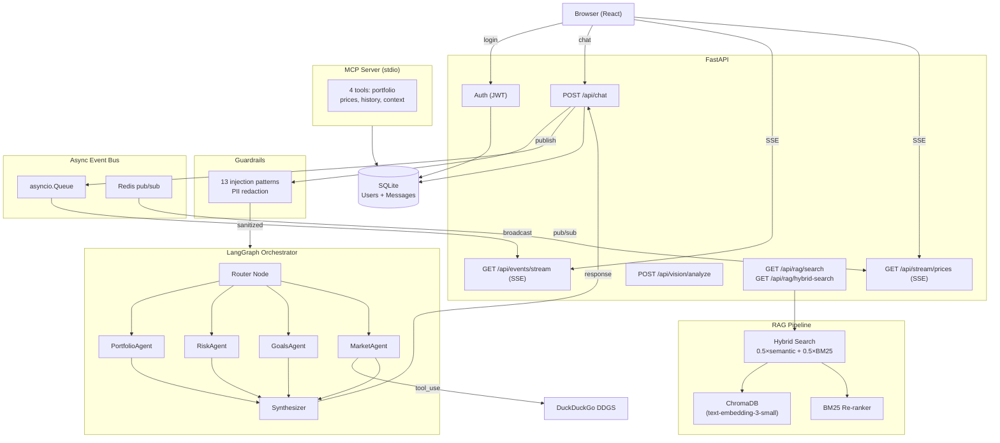

# AuraWealth

Consumer wealth management app — agentic AI advisor for clients and a command center for advisors.

## Stack

- **Backend**: Python + FastAPI (async), SQLite, Redis, ChromaDB
- **Frontend**: React + Vite + Tailwind CSS
- **AI**: Anthropic SDK (claude-sonnet-4-6), LangGraph, OpenAI embeddings, Ollama

## Quick Start

### Backend

```bash
cd server
python -m venv .venv && source .venv/bin/activate
pip install -r requirements.txt
cp env.example .env  # add your API keys
uvicorn main:app --reload
```

### Frontend

```bash
cd client
npm install
npm run dev
```

## Architecture



## Demo Users

| Email | Password | Role |
|-------|----------|------|
| alice@example.com | password123 | Client |
| bob@example.com | password123 | Client |
| advisor@aurawealth.com | advisor123 | Advisor |
